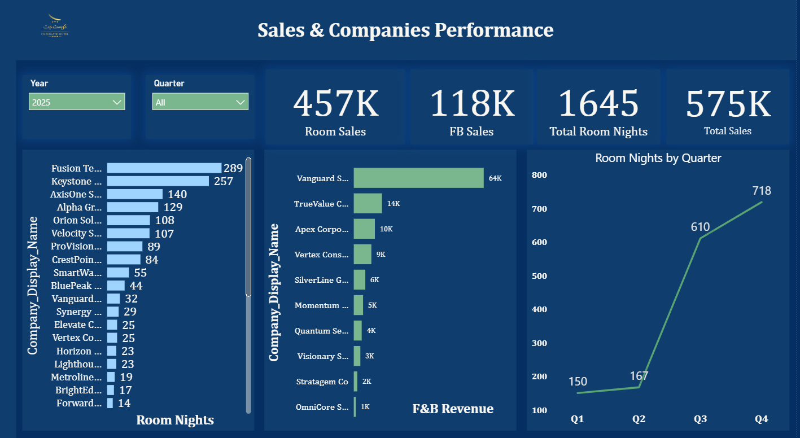
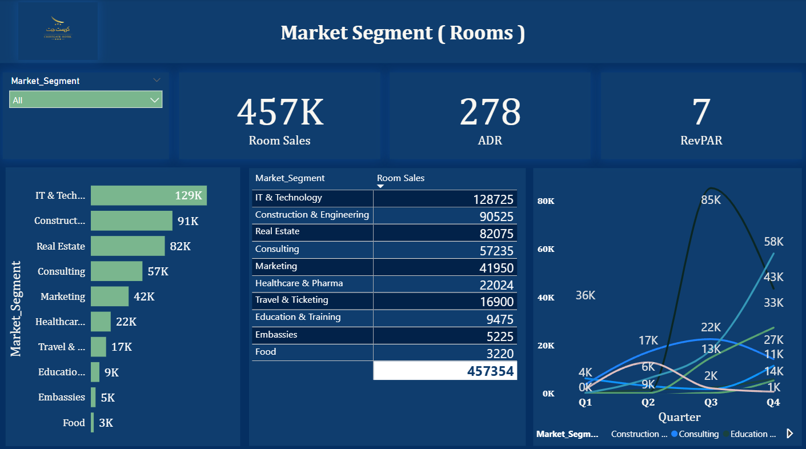
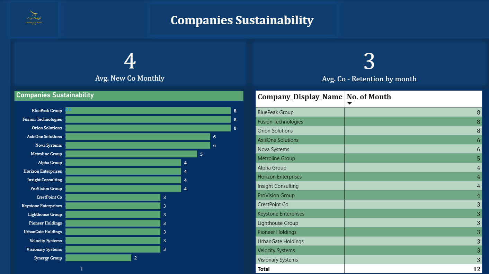

# Hotel Sales Performance Dashboard (Power BI)

A comprehensive **Power BI dashboard** analyzing hotel sales performance,
key accounts, customer retention, and operational KPIs.

> ⚠️ This project is created for **portfolio purposes only**.  
> All company names and branding are **fictional**.

---

## 🖼 Dashboard Screenshots

### Total Companies Performance

### Key Accounts – Pareto Analysis
.png)

### Market Segment Analysis

### Companies Sustainability & Retention

---

## 🎯 Project Objectives
- Analyze Room & F&B revenue performance
- Identify key accounts using Pareto (80/20) analysis
- Evaluate market segment contribution
- Measure customer retention and sustainability
- Track hotel KPIs (ADR, RevPAR, Room Nights)

---

## 📊 Key Metrics
- Room Sales  
- F&B Sales  
- Total Sales  
- Room Nights  
- ADR (Average Daily Rate)  
- RevPAR (Revenue per Available Room)  
- Top 80% Key Accounts  
- Average Company Retention (Months)  
- Average New Companies per Month  

---

## 🧠 Data Model
- Star schema design
- Fact tables:
  - Room Revenue
  - F&B Revenue
- Dimension tables:
  - Date
  - Company
  - Market Segment
- Relationships built using **Company_ID**

---

## 🛠 Tools & Technologies
- Power BI Desktop  
- Power Query  
- DAX  
- Data Visualization & Analytics  

---

## 📁 Repository Structure
